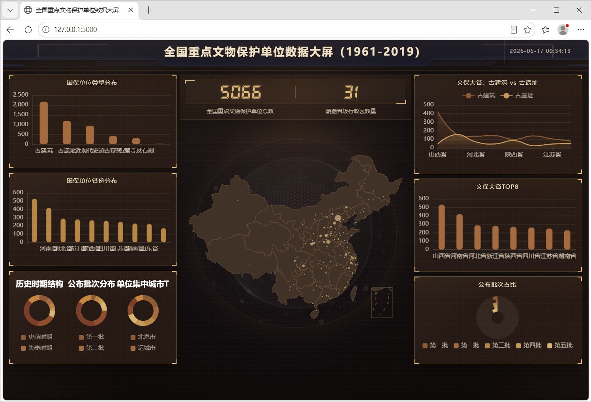

# big_screen
数据大屏可视化

# 数据源
https://www.geodoi.ac.cn/WebCn/doi.aspx?Id=3503

# 功能

便利性工具, 结构简单, 直接传数据就可以实现数据大屏

# 安装

```
pip install -i https://pypi.tuna.tsinghua.edu.cn/simple flask xlrd==1.2.0
```

# 运行

```
python app.py;
```

* 全国重点文物保护单位数据大屏 http://127.0.0.1:5000/        

# 示例



# 使用

- 1、编辑 data.py 中的 SourceData 类（或者新增类，新增的话需要编辑 app.py 增加路由，请参考 SourceData）
- 2、首页 `/` 现在默认读取项目根目录下的 `CulRelPro_China_1961-2019.xls`，并转换为现有 SourceDataDemo 数据结构
- 3、`/api/data` 返回 Excel 的真实统计结果，不再做模拟累计增长
- 4、运行 python app.py 查看首页数据变更后的效果

# 参考

> https://gitee.com/lvyeyou/DaShuJuZhiDaPingZhanShi
